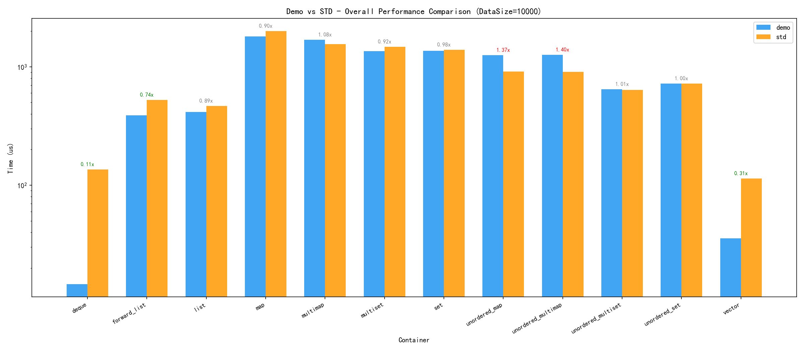

# demo-STL - 自定义STL容器实现

[](LICENSE)
[](https://en.cppreference.com/w/cpp/17)

## 项目概述

`demo-STL` 是一个基于 C++17 标准实现的自定义 STL（Standard Template Library）容器库，旨在深入理解 STL 容器的底层实现原理，同时提供与标准库兼容的接口设计。本项目不仅是学习 STL 内部机制的绝佳资源，也是一个可用于实际项目的轻量级容器库。

### 项目目标

- **教育价值**：提供清晰、可读的 STL 容器实现代码，帮助开发者深入理解容器的内部工作机制
- **兼容性**：接口设计严格对齐 `std::` 标准库，保证代码的可移植性和易用性
- **扩展性**：模块化设计，便于添加新的容器类型和功能扩展
- **性能优化**：在保证正确性的前提下，优化关键路径的性能表现
- **异常安全**：提供完善的异常处理机制，确保内存安全和程序稳定性


### demo-STL vs std-STL

demo-STL 和 std-STL 各有明显优势，无法简单判定谁"更好"。demo 在顺序容器（尤其是 deque 和 vector）的多数操作上大幅领先 std，但在关联容器的遍历、list 排序、以及无序容器的删除操作上明显落后。 综合来看，demo 在 15 个容器中取得了约 45% 的操作领先，std 在约 35% 的操作中领先，其余约 20% 持平。



**详细文档跳转**：跳转至[demo::benchmark详细数据对比](./benchmark/benchmark_analysis.md)

| 容器 | demo 优势 | std 优势 | 综合判断 |
|------|-----------|----------|----------|
| **deque** | ★★★★★ | ★ | **demo 碾压** |
| **stack** | ★★★★★ | ★ | **demo 碾压** |
| **queue** | ★★★★★ | ★ | **demo 碾压** |
| **vector** | ★★★★ | ★★★ | demo 略优 |
| **list** | ★★ | ★★★ | std 略优 |
| **forward_list** | ★★ | ★★★ | std 略优 |
| **map** | ★★★ | ★★★ | 基本持平 |
| **multimap** | ★★★ | ★★ | 基本持平 |
| **set** | ★★★ | ★★ | 基本持平 |
| **multiset** | ★★★ | ★★ | 基本持平 |
| **unordered_map** | ★★ | ★★★ | std 略优 |
| **unordered_set** | ★★ | ★★★★ | **std 明显优** |
| **unordered_multimap** | ★★ | ★★★ | std 略优 |
| **unordered_multiset** | ★★ | ★★★ | std 略优 |
| **priority_queue** | ★★ | ★★★ | std 略优 |

### 设计理念

1. **RAII 原则**：所有资源管理遵循 RAII（Resource Acquisition Is Initialization）原则，确保异常安全
2. **分配器抽象**：使用 `std::allocator` 作为默认分配器，支持自定义分配器扩展
3. **迭代器设计**：实现符合标准的迭代器类型，支持 STL 算法库
4. **异常处理**：提供明确的异常抛出机制，便于调试和错误处理
5. **代码规范**：遵循现代 C++ 编码规范，代码清晰、注释完善

## 功能特性

### 已实现容器

| 容器名称                   | 类型       | 状态      | 核心特性                                    |
| :------------------------- | :--------- | :-------- | :------------------------------------------ |
| `demo::vector`             | 动态数组   | ✅ 已实现 | 随机访问、动态扩容、异常安全                |
| `demo::forward_list`       | 单向链表   | ✅ 已实现 | 前向迭代、O(1) 前端操作、低内存开销         |
| `demo::list`               | 双向链表   | ✅ 已实现 | 双向迭代、O(1) 任意位置操作、迭代器稳定     |
| `demo::deque`              | 双端队列   | ✅ 已实现 | 双端操作、分段存储、随机访问迭代器          |
| `demo::map`                | 关联容器   | ✅ 已实现 | 有序键值对、红黑树实现、O(log n) 查找       |
| `demo::multimap`           | 关联容器   | ✅ 已实现 | 有序可重复键值对、红黑树实现、O(log n) 查找 |
| `demo::set`                | 关联容器   | ✅ 已实现 | 有序唯一键、红黑树实现、O(log n) 查找       |
| `demo::multiset`           | 关联容器   | ✅ 已实现 | 有序可重复键、红黑树实现、O(log n) 查找     |
| `demo::unordered_map`      | 关联容器   | ✅ 已实现 | 无序键值对、哈希表实现、O(1) 平均查找       |
| `demo::unordered_set`      | 关联容器   | ✅ 已实现 | 无序唯一键、哈希表实现、O(1) 平均查找       |
| `demo::unordered_multimap` | 关联容器   | ✅ 已实现 | 无序可重复键值对、哈希表实现、O(1) 平均查找 |
| `demo::unordered_multiset` | 关联容器   | ✅ 已实现 | 无序可重复键、哈希表实现、O(1) 平均查找     |
| `demo::stack`              | 容器适配器 | ✅ 已实现 | LIFO 结构、双端队列适配、栈顶操作           |
| `demo::queue`              | 容器适配器 | ✅ 已实现 | FIFO 结构、双端队列适配、双向访问           |
| `demo::priority_queue`     | 容器适配器 | ✅ 已实现 | 优先级队列、堆数据结构、O(log n) 插入删除   |

### 核心功能

- **动态数组容器 (`demo::vector`)**
  - 支持随机访问（`operator[]`、`at()`）
  - 智能动态扩容策略
  - 完整的元素生命周期管理
  - 支持移动语义和完美转发

- **单向链表容器 (`demo::forward_list`)**
  - 仅支持前向迭代器
  - O(1) 时间复杂度的前端插入/删除
  - 内置归并排序算法
  - 低内存开销（每个节点仅一个指针）

- **双向链表容器 (`demo::list`)**
  - 支持双向迭代器和反向迭代器
  - O(1) 时间复杂度的首尾操作和任意位置插入/删除
  - 迭代器稳定性（增删不影响其他迭代器）
  - 内置排序、合并、拼接、反转、去重等操作

- **双端队列容器 (`demo::deque`)**
  - 支持随机访问迭代器（`operator[]`、`at()`）
  - O(1) 时间复杂度的双端增删操作（`push_front`/`pop_front`、`push_back`/`pop_back`）
  - 分段存储结构（Map + Buffer），避免扩容时的大量元素移动
  - 支持移动语义和完美转发，高效的 emplace 系列接口

- **关联容器 (`demo::map`)**
  - 基于红黑树实现，保证 O(log n) 的插入、删除和查找操作
  - 存储键值对（key-value pairs），键唯一且自动排序
  - 支持双向迭代器，按中序遍历顺序访问元素
  - 提供 `find()`、`lower_bound()`、`upper_bound()`、`equal_range()` 等查找接口
  - 支持 `insert_or_assign()`、`try_emplace()` 等高效插入操作

- **关联容器 (`demo::multimap`)**
  - 基于红黑树实现，保证 O(log n) 的插入、删除和查找操作
  - 存储键值对（key-value pairs），允许键重复且自动排序
  - 支持双向迭代器，按中序遍历顺序访问元素
  - 提供 `find()`、`count()`、`equal_range()`、`lower_bound()`、`upper_bound()` 等查找接口
  - `insert()` 始终插入成功并返回 `iterator`，`erase(key)` 删除所有匹配键的元素
  - 不提供 `operator[]`、`at()`、`insert_or_assign()`、`try_emplace()`（键不唯一，访问/赋值目标不明确）

- **关联容器 (`demo::set`)**
  - 基于红黑树实现，保证 O(log n) 的插入、删除和查找操作
  - 存储唯一键值（keys），键自动排序
  - 支持双向迭代器，按中序遍历顺序访问元素
  - 提供 `find()`、`lower_bound()`、`upper_bound()` 等查找接口
  - 支持 `insert()`、`erase()` 等高效插入操作

- **关联容器 (`demo::multiset`)**
  - 基于红黑树实现，保证 O(log n) 的插入、删除和查找操作
  - 存储键（keys），允许键重复且自动排序
  - 支持双向迭代器，按中序遍历顺序访问元素
  - 提供 `find()`、`count()`、`equal_range()`、`lower_bound()`、`upper_bound()` 等查找接口
  - `insert()` 始终插入成功并返回 `iterator`，`erase(key)` 删除所有匹配键的元素，返回删除数量
  - 不提供 `operator[]` 和 `at()`（键不唯一，访问目标不明确）
  - 支持合并异类型 multiset 的 `merge()` 操作

- **关联容器 (`demo::unordered_map`)**
  - 基于哈希表实现，保证平均 O(1) 的插入、删除和查找操作
  - 存储键值对（key-value pairs），键唯一但不保证顺序
  - 支持前向迭代器，按桶顺序访问元素
  - 提供 `find()`、`count()`、`equal_range()` 等查找接口
  - 支持 `insert_or_assign()`、`try_emplace()` 等高效插入操作
  - 支持负载因子调整、重哈希、预留空间等哈希策略管理

- **关联容器 (`demo::unordered_set`)**
  - 基于哈希表实现，保证平均 O(1) 的插入、删除和查找操作
  - 存储唯一键（keys），键唯一但不保证顺序
  - 支持前向迭代器，按桶顺序访问元素
  - 提供 `find()`、`count()`、`equal_range()` 等查找接口
  - 支持 `emplace()`、`insert()` 等高效插入操作，自动去重
  - 支持负载因子调整、重哈希、预留空间等哈希策略管理
  - 支持合并异类型 unordered_set 的 `merge()` 操作

- **关联容器 (`demo::unordered_multimap`)**
  - 基于哈希表实现，保证平均 O(1) 的插入、删除和查找操作
  - 存储键值对（key-value pairs），键可重复但不保证顺序
  - 支持前向迭代器，按桶顺序访问元素；提供 `local_iterator`/`const_local_iterator` 桶内迭代器
  - 提供 `find()`（返回任意一个匹配键的元素）、`count()`（可返回大于 1 的值）、`equal_range()`（可返回包含多个元素的范围）等查找接口
  - 支持 `insert()`（拷贝/移动版本，始终插入成功，返回 `iterator`）、`emplace()`（原地构造，返回 `iterator`）、`emplace_hint()` 等高效插入操作
  - `erase(key)` 删除所有匹配键的元素，返回删除数量（区别于 `unordered_map`）
  - 不提供 `operator[]`、`at()`、`insert_or_assign()`、`try_emplace()`（键不唯一，访问/赋值目标不明确）
  - 支持合并异类型 `unordered_multimap` 的 `merge()` 操作，所有元素都会被合并（不检查键冲突）
  - 支持负载因子调整、重哈希、预留空间等哈希策略管理
  - 支持 `bucket_count()`、`max_bucket_count()`、`bucket_size(n)`、`bucket(k)`、`begin(n)`/`end(n)` 等桶相关接口

- **关联容器 (`demo::unordered_multiset`)**
  - 基于哈希表实现，保证平均 O(1) 的插入、删除和查找操作
  - 存储键（keys），键可重复但不保证顺序
  - 支持前向迭代器，按桶顺序访问元素；提供 `local_iterator`/`const_local_iterator` 桶内迭代器
  - 提供 `find()`（返回任意一个匹配键的元素）、`count()`（可返回大于 1 的值）、`equal_range()`（可返回包含多个元素的范围）等查找接口
  - 支持 `insert()`（拷贝/移动版本，始终插入成功，返回 `iterator`）、`emplace()`（原地构造，返回 `iterator`）、`emplace_hint()` 等高效插入操作
  - `erase(key)` 删除所有匹配键的元素，返回删除数量（区别于 `unordered_set`）
  - 支持合并异类型 `unordered_multiset` 的 `merge()` 操作，所有元素都会被合并（不检查键冲突）
  - 支持负载因子调整、重哈希、预留空间等哈希策略管理
  - 支持 `bucket_count()`、`max_bucket_count()`、`bucket_size(n)`、`bucket(k)`、`begin(n)`/`end(n)` 等桶相关接口

- **容器适配器 (`demo::stack`)**
  - 基于 deque 实现的后进先出（LIFO）栈适配器
  - 支持栈顶插入（push）、删除（pop）和访问（top）操作
  - 默认使用 deque 作为底层容器，也可使用 vector 或 list
  - 支持拷贝构造、移动构造和赋值运算符重载
  - 提供 `empty()`、`size()`、`swap()` 等接口
  - 支持 emplace() 原地构造元素

- **容器适配器 (`demo::queue`)**
  - 基于 deque 实现的先进先出（FIFO）队列适配器
  - 支持队尾插入（push）、队首删除（pop）、队首访问（front）和队尾访问（back）操作
  - 默认使用 deque 作为底层容器，也可使用 list（不推荐使用 vector）
  - 支持拷贝构造、移动构造和赋值运算符重载
  - 提供 `empty()`、`size()`、`swap()` 等接口
  - 支持 emplace() 原地构造元素

- **容器适配器 (`demo::priority_queue`)**
  - 基于 vector 实现的优先队列适配器，使用堆数据结构
  - 支持 O(log n) 时间复杂度的插入（push）和删除（pop）操作
  - 默认使用 vector 作为底层容器，也可使用 deque
  - 默认使用 `std::less` 实现最大堆（顶部为最大元素），支持自定义比较函数实现最小堆
  - 支持拷贝构造、移动构造和赋值运算符重载
  - 提供 `top()` 访问顶部元素、`empty()`、`size()`、`swap()` 等接口
  - 支持 emplace() 原地构造元素，使用 Floyd 算法高效建堆

## 快速开始

### 环境要求

- **编译器**：GCC 8.0+、Clang 6.0+、MSVC 2019+
- **标准**：C++17 及以上
- **构建工具**：CMake 3.16+（推荐）

### 编译项目

```bash
# 创建构建目录
mkdir build && cd build

# 生成构建文件
cmake ..

# 编译项目
cmake --build .

# 运行测试
ctest
```

### 使用示例

```c++
#include <iostream>
#include "list/list.h"

int main() {
    // 创建双向链表
    demo::list<int> lst{1, 2, 3, 4, 5};

    // 尾部插入
    lst.push_back(6);

    // 头部插入
    lst.push_front(0);

    // 遍历链表
    for (const auto& val : lst) {
        std::cout << val << " ";
    }
    std::cout << std::endl;

    // 排序
    lst.sort();

    // 反向遍历
    for (auto it = lst.rbegin(); it != lst.rend(); ++it) {
        std::cout << *it << " ";
    }
    std::cout << std::endl;

    return 0;
}
```

## 项目结构

```
demo-STL/
├── README.md                    # 项目说明文档（本文件）
├── 自定义STL容器综合文档.md        # 容器综合文档入口
├── CMakeLists.txt               # 项目构建配置
├── list/                        # 链表容器模块
│   ├── list.h                   # 双向链表实现
│   ├── forward_list.h           # 单向链表实现
│   ├── list.md                  # list详细文档
│   ├── forward_list.md          # forward_list详细文档
│   └── utests/                  # 测试用例目录
│       ├── CMakeLists.txt       # 测试构建配置
│       ├── doctest.h            # 测试框架
│       ├── test_list.cpp        # list测试用例
│       └── main.cpp             # 测试入口
├── vector/                      # 动态数组容器模块
│   ├── vector.h                 # 动态数组实现
│   ├── vector.md                # vector详细文档
│   └── utests/                  # 测试用例目录
│       ├── CMakeLists.txt       # 测试构建配置
│       ├── doctest.h            # 测试框架
│       ├── test_vector.cpp      # vector测试用例
│       └── main.cpp             # 测试入口
├── deque/                       # 双端队列容器模块
│   ├── deque.h                  # 双端队列实现
│   ├── deque.md                 # deque详细文档
│   └── utest/                   # 测试用例目录
│       ├── CMakeLists.txt       # 测试构建配置
│       ├── doctest.h            # 测试框架
│       ├── test_deque.cpp       # deque测试用例
│       └── main.cpp             # 测试入口
├── map/                         # 关联容器模块（有序）
│     ├── map.h                  # map实现
│     ├── map.md                 # map详细文档
│     └── utest/                 # 测试用例目录
│       ├── CMakeLists.txt       # 测试构建配置
│       ├── doctest.h            # 测试框架
│       ├── test_map.cpp         # map测试用例
│       └── main.cpp             # 测试入口
├── multimap/                    # 关联容器模块（有序可重复键值对）
│     ├── multimap.h             # multimap实现
│     ├── multimap.md            # multimap详细文档
│     └── utests/                # 测试用例目录
│       ├── CMakeLists.txt       # 测试构建配置
│       ├── doctest.h            # 测试框架
│       ├── test_multimap.cpp    # multimap测试用例
│       └── main.cpp             # 测试入口
├── set/                         # 关联容器模块（有序）
│     ├── set.h                  # set实现
│     ├── set.md                 # set详细文档
│     └── utest/                 # 测试用例目录
│       ├── CMakeLists.txt       # 测试构建配置
│       ├── doctest.h            # 测试框架
│       ├── test_set.cpp         # set测试用例
│       └── main.cpp             # 测试入口
├── multiset/                    # 关联容器模块（有序可重复键）
│     ├── multiset.h             # multiset实现
│     ├── multiset.md            # multiset详细文档
│     └── utests/                # 测试用例目录
│       ├── CMakeLists.txt       # 测试构建配置
│       ├── doctest.h            # 测试框架
│       ├── test_multiset.cpp    # multiset测试用例
│       └── main.cpp             # 测试入口
├──  unordered_map/               # 关联容器模块（无序）
│      ├── unordered_map.h        # unordered_map实现
│      ├── unordered_map.md       # unordered_map详细文档
│      └── utest/                 # 测试用例目录
│        ├── CMakeLists.txt       # 测试构建配置
│        ├── doctest.h            # 测试框架
│        ├── test_unordered_map.cpp # unordered_map测试用例
│        └── main.cpp             # 测试入口
├── unordered_set/                # 关联容器模块（无序集合）
│      ├── unordered_set.h        # unordered_set实现
│      ├── unordered_set.md       # unordered_set详细文档
│      └── utests/                # 测试用例目录
│        ├── CMakeLists.txt       # 测试构建配置
│        ├── doctest.h            # 测试框架
│        ├── test_unordered_set.cpp # unordered_set测试用例
│        └── main.cpp              # 测试入口
├── unordered_multimap/            # 关联容器模块（无序可重复键值对）
│      ├── unordered_multimap.h    # unordered_multimap实现
│      ├── unordered_multimap.md   # unordered_multimap详细文档
│      └── utests/                 # 测试用例目录
│        ├── CMakeLists.txt        # 测试构建配置
│        ├── doctest.h             # 测试框架
│        ├── test_unordered_multimap.cpp # unordered_multimap测试用例
│        └── main.cpp              # 测试入口
├── unordered_multiset/            # 关联容器模块（无序可重复集合）
│      ├── unordered_multiset.h    # unordered_multiset实现
│      ├── unordered_multiset.md   # unordered_multiset详细文档
│      └── utests/                 # 测试用例目录
│        ├── CMakeLists.txt        # 测试构建配置
│        ├── doctest.h             # 测试框架
│        ├── test_unordered_multiset.cpp # unordered_multiset测试用例
│        └── main.cpp              # 测试入口
├── stack/                        # 容器适配器模块（栈）
│     ├── stack.h                 # stack实现
│     ├── stack.md                # stack详细文档
│     └── utests/                 # 测试用例目录
│       ├── CMakeLists.txt        # 测试构建配置
│       ├── doctest.h             # 测试框架
│       ├── test_deque_stack.cpp  # stack测试用例(deque为底层容器)
│       ├── test_list_stack.cpp   # stack测试用例(list为底层容器)
│       ├── test_vector_stack.cpp # stack测试用例(vector为底层容器)
│       └── main.cpp              # 测试入口
├── queue/                        # 容器适配器模块（队列）
│      ├── queue.h                # queue实现
│      ├── queue.md               # queue详细文档
│      └── utests/                # 测试用例目录
│        ├── CMakeLists.txt       # 测试构建配置
│        ├── doctest.h            # 测试框架
│        ├── test_deque_queue.cpp # queue测试用例(deque为底层容器)
│        ├── test_list_queue.cpp  # queue测试用例(list为底层容器)
│        └── main.cpp             # 测试入口
├── priority_queue/               # 容器适配器模块（优先队列）
      ├── priority_queue.h        # priority_queue实现
      ├── priority_queue.md       # priority_queue详细文档
      └── utests/                 # 测试用例目录
        ├── CMakeLists.txt        # 测试构建配置
        ├── doctest.h             # 测试框架
        ├── test_vector_priority_queue.cpp  # priority_queue测试用例(vector为底层容器)
        ├── test_deque_priority_queue.cpp  # priority_queue测试用例(deque为底层容器)
        └── main.cpp              # 测试入口
```

## API 参考

### 容器总览

完整的 API 文档请参考：[自定义STL容器综合文档](./自定义STL容器综合文档.md)

#### 通用接口

所有容器均支持以下通用操作：

| 接口              | 功能说明                          |
| :---------------- | :-------------------------------- |
| `empty()`         | 判断容器是否为空                  |
| `size()`          | 返回元素个数（forward_list 除外） |
| `max_size()`      | 返回最大可存储元素数              |
| `clear()`         | 清空容器                          |
| `swap()`          | 交换两个容器内容                  |
| `get_allocator()` | 返回分配器副本                    |

#### 迭代器接口

| 迭代器类型         | 说明           | 支持操作                               | 支持容器         |
| :----------------- | :------------- | :------------------------------------- | :--------------- |
| `iterator`         | 可变迭代器     | `++`, `--`, `*`, `->`                  | 所有容器         |
| `const_iterator`   | 常量迭代器     | 只读访问                               | 所有容器         |
| `reverse_iterator` | 反向迭代器     | 反向遍历                               | list, deque, map |
| `random_access`    | 随机访问迭代器 | `++`, `--`, `[]`, `+`, `-`, 比较运算符 | vector, deque    |

## 测试框架

本项目使用 [doctest](https://github.com/onqtam/doctest) 作为测试框架，测试用例位于 `*/utests/` 目录下：

- **测试覆盖**：每个容器均包含完整的单元测试
- **测试类型**：涵盖正常流程、边界条件、异常场景
- **运行方式**：通过 CTest 运行所有测试用例

## 许可证

本项目采用 MIT 许可证，详见 [LICENSE](LICENSE) 文件。


## 现存问题

### 1.关联容器的查询接口的透明版本的实现

- 具体问题： 想通过SFINAE机制在编译期就根据T的类型（是否支持透明比较）决定是否生成透明接口，但是这种写法会导致如果T不是支持透明比较的类型，会导致整个容器都声明失败

### 2.  哈希表（unordered_/set/multiset/map/multimap）带提示位置的插入接口的实现

- 具体问题：目前的实现只是为了接口的统一而直接把`hint` 忽略的，不进行任何优化的
- 详细原因：因为在插入时，我的设计原理是把key相同的键值对连续存储的，如果直接按提示位置插入，可能会导致key相同的连续键值对截断从而`equal_range` 返回的范围受到影响。如果对提示位置是否会导致key相同的连续键值对截断进行判断，会有O(m)的开销（m为key相同的连续键值对个数），那还不如不优化，直接计算哈希值，计算桶索引，执行普通插入逻辑。导致目前想不到在我的这种设计原理下的更好的优化方案。

## 致谢

- 感谢 C++ 标准库委员会提供的优秀接口设计
- 感谢 doctest 提供的轻量级测试框架

---

**文档版本**：v1.15
**最后更新**：2026-06-04
**项目地址**：[demo-STL](https://github.com/wgc918/demo-STL)

> **提示**：如需了解各容器的详细实现，请查阅 [自定义STL容器综合文档](./自定义STL容器综合文档.md)

