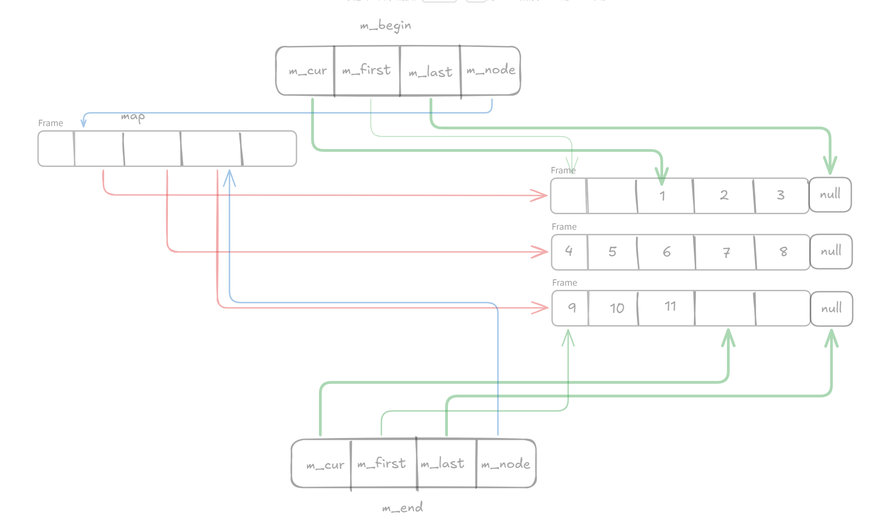

# demo::deque 容器开发文档

## 1. 文档概述

### 1.1 文档目的

本文档详细描述自定义实现的 `demo::deque` 双端队列容器的设计思路、核心功能、接口规范、使用方法及注意事项，为开发者提供完整的开发、测试和维护参考，同时对齐 C++ 标准库 `std::deque` 的接口设计，保证兼容性和易用性。

### 1.2 容器简介

`demo::deque` 是一个遵循 C++17 标准的**双端队列容器**（Double-ended Queue），支持在首尾两端高效插入和删除元素，并提供随机访问能力。与 `demo::list`（双向链表）相比，`deque` 在保持高效首尾操作的同时，还支持 O(1) 的随机访问，但中间插入删除效率较低。

### 1.3 适用范围

- 编译环境：兼容 GCC、Clang、MSVC 等主流编译器，需开启 C++17 及以上标准（`-std=c++17`）；
- 元素类型：支持任意可拷贝 / 可移动 / 可析构的类型（内置类型、`std::string`、自定义类等）；
- 应用场景：适合需要频繁在首尾插入 / 删除元素、需要随机访问、作为队列 / 双端队列使用的场景（如任务队列、滑动窗口、缓存管理）。

## 2. 设计思路

### 2.1 核心架构

#### 2.1.1 存储结构

`deque` 采用**二级指针结构（Map + Buffer）**实现，核心设计如下：



每个 buffer 包含固定数量的元素（`m_buffer_size = 512 / sizeof(value_type)`），保证每个 buffer 约 512 字节。

#### 2.1.2 容器核心成员

|     成员变量      |         类型         |                              作用                               |
| :---------------: | :------------------: | :-------------------------------------------------------------: |
|      `m_map`      |    `value_type**`    | 指向 buffer 指针数组的指针（map），每个元素是一个 buffer 的指针 |
|   `m_map_size`    |     `size_type`      |                    map 的大小（buffer 数量）                    |
|   `m_allocator`   |   `allocator_type`   |                    元素分配器，管理元素内存                     |
| `m_map_allocator` | `map_allocator_type` |             map 分配器，管理 buffer 指针数组的内存              |
|     `m_begin`     |      `iterator`      |                   指向第一个有效元素的迭代器                    |
|      `m_end`      |      `iterator`      |              指向最后一个有效元素之后位置的迭代器               |
|  `m_buffer_size`  |     `size_type`      |  每个 buffer 的元素数量（静态常量，512 / sizeof(value_type)）   |

#### 2.1.3 架构优势

- **高效首尾操作**：通过维护首尾迭代器，首尾插入删除均为 O(1) 复杂度；
- **随机访问支持**：通过计算元素所在的 buffer 和偏移量，实现 O(1) 的随机访问；
- **动态扩展**：当首尾空间不足时，可扩展 map 数组（扩容策略：容量翻倍）；
- **内存局部性**：同一 buffer 内的元素连续存储，缓存友好；
- **居中扩展**：扩容时将现有 buffer 移动到新 map 的中间位置，保持双向扩展能力。

### 2.2 迭代器设计

`deque` 支持**随机访问迭代器（std::random_access_iterator_tag）**，迭代器内部包含四级结构：

```c++
class iterator {
    pointer m_cur;           // 当前元素指针
    pointer m_first;         // 当前 buffer 的起始指针
    pointer m_last;          // 当前 buffer 的结束指针（不包含）
    value_type** m_map_node; // 当前 buffer 在 map 中的指针
};
```

迭代器类型及特性如下：

|        迭代器类型        |         说明         |                           核心特性                            |
| :----------------------: | :------------------: | :-----------------------------------------------------------: |
|        `iterator`        |  可变随机访问迭代器  | 支持 `++`/`--`、`+`/`-`、`+=`/`-=`、`[]`、`*`、`->`、比较运算 |
|     `const_iterator`     | 不可变随机访问迭代器 |      与 `iterator` 功能一致，但仅能读取元素值，不可修改       |
|    `reverse_iterator`    |    可变反向迭代器    |              基于标准库适配器实现，支持反向遍历               |
| `const_reverse_iterator` |   不可变反向迭代器   |                      常量版本反向迭代器                       |

### 2.3 内存管理策略

1. **Buffer 分配**：按需分配 buffer，每个 buffer 大小固定（约 512 字节）；
2. **Map 扩容**：当首尾扩展超出当前 map 范围时，将 map 容量翻倍，并将现有 buffer 移动到新 map 的中间位置；
3. **元素构造**：使用完美转发（`std::forward`）实现原地构造，避免不必要的拷贝；
4. **移动语义**：移动构造 / 赋值时仅交换指针和分配器，时间复杂度 O(1)；
5. **内存释放**：析构时遍历所有 buffer，销毁元素并释放 buffer 内存，最后释放 map 数组；
6. **异常安全**：构造元素时捕获异常，保证内存不泄漏。

### 2.4 核心算法实现

#### 2.4.1 随机访问算法

通过数学计算定位元素位置：

```
slot_index = pos / m_buffer_size    // 计算元素所在的 buffer 索引
offset = pos % m_buffer_size        // 计算元素在 buffer 中的偏移量
element = m_map[slot_index][offset] // 定位元素
```

#### 2.4.2 迭代器算术运算

跨 buffer 的迭代器移动需要计算目标 buffer 和偏移量：

- **加法运算**：若目标位置在当前 buffer 内，直接移动；否则计算跨 buffer 的偏移；
- **减法运算**：类似加法，但方向相反；
- **距离计算**：同一 buffer 内直接相减，跨 buffer 需累加中间 buffer 的元素数。

#### 2.4.3 插入算法

插入元素时选择移动代价较小的方向：

1. 计算插入位置距离首尾的距离；
2. 若距离头部更近，从头部扩展并将前半部分元素后移；
3. 若距离尾部更近，从尾部扩展并将后半部分元素前移；
4. 批量插入时可能需要扩展 map 数组。

## 3. 接口说明

### 3.1 类型别名（Type Aliases）

|         类型别名         |                        含义                         |
| :----------------------: | :-------------------------------------------------: |
|       `value_type`       |              容器存储的元素类型（`T`）              |
|        `pointer`         |                元素指针类型（`T*`）                 |
|     `const_pointer`      |           常量元素指针类型（`const T*`）            |
|       `reference`        |                元素引用类型（`T&`）                 |
|    `const_reference`     |           常量元素引用类型（`const T&`）            |
|     `allocator_type`     | 分配器类型（`Allocator`，默认 `std::allocator<T>`） |
|       `size_type`        |           无符号整数类型（`std::size_t`）           |
|    `difference_type`     |         有符号整数类型（`std::ptrdiff_t`）          |
|        `iterator`        |                 可变随机访问迭代器                  |
|     `const_iterator`     |                不可变随机访问迭代器                 |
|    `reverse_iterator`    |                   可变反向迭代器                    |
| `const_reverse_iterator` |                  不可变反向迭代器                   |

### 3.2 构造与析构

|                  接口                   |                  功能说明                  |                          示例                           |
| :-------------------------------------: | :----------------------------------------: | :-----------------------------------------------------: |
|                `deque()`                |     空构造，创建默认大小（8）的空 map      |                 `demo::deque<int> dq;`                  |
|        `deque(size_type count)`         |   创建包含 `count` 个默认构造元素的队列    |            `demo::deque<std::string> dq(3);`            |
| `deque(size_type count, const T& val)`  | 创建包含 `count` 个值为 `val` 的元素的队列 |              `demo::deque<int> dq(5, 10);`              |
|  `deque(InputIt first, InputIt last)`   |               迭代器范围构造               | `int arr[] = {1,2,3}; demo::deque<int> dq(arr, arr+3);` |
| `deque(std::initializer_list<T> ilist)` |               初始化列表构造               |              `demo::deque<int> dq{1,2,3};`              |
|       `deque(const deque& other)`       |         拷贝构造（深拷贝所有元素）         |              `demo::deque<int> dq2(dq1);`               |
|     `deque(deque&& other) noexcept`     |           移动构造（仅交换指针）           |         `demo::deque<int> dq2(std::move(dq1));`         |
|               `~deque()`                |      析构函数，销毁所有元素并释放内存      |                            -                            |

### 3.3 赋值操作

|                        接口                        |                  功能说明                  |           示例           |
| :------------------------------------------------: | :----------------------------------------: | :----------------------: |
|       `deque& operator=(const deque& other)`       |      拷贝赋值（先清空自身，再深拷贝）      |       `dq2 = dq1;`       |
|     `deque& operator=(deque&& other) noexcept`     |        移动赋值（交换指针和分配器）        | `dq2 = std::move(dq1);`  |
| `deque& operator=(std::initializer_list<T> ilist)` |               初始化列表赋值               |     `dq = {4,5,6};`      |
|    `void assign(size_type count, const T& val)`    | 赋值 `count` 个 `val` 元素（覆盖原有数据） |    `dq.assign(2, 0);`    |
|     `void assign(InputIt first, InputIt last)`     |               迭代器范围赋值               | `dq.assign(arr, arr+2);` |
|   `void assign(std::initializer_list<T> ilist)`    |               初始化列表赋值               |  `dq.assign({7,8,9});`   |

### 3.4 迭代器接口

|                   接口                   |            功能说明            |      注意事项      |
| :--------------------------------------: | :----------------------------: | :----------------: |
|       `iterator begin() noexcept`        | 返回指向第一个元素的可变迭代器 | 空队列返回 `end()` |
| `const_iterator begin() const noexcept`  |       常量版本 `begin()`       |         -          |
| `const_iterator cbegin() const noexcept` |     显式常量版本 `begin()`     |         -          |
|        `iterator end() noexcept`         | 返回尾后迭代器（最后元素之后） |     不可解引用     |
|  `const_iterator end() const noexcept`   |        常量版本 `end()`        |         -          |
|  `const_iterator cend() const noexcept`  |      显式常量版本 `end()`      |         -          |
|       `reverse_iterator rbegin()`        |  返回指向最后元素的反向迭代器  |         -          |
| `const_reverse_iterator rbegin() const`  |      常量版本 `rbegin()`       |         -          |
| `const_reverse_iterator crbegin() const` |    显式常量版本 `rbegin()`     |         -          |
|        `reverse_iterator rend()`         |       返回反向尾后迭代器       |         -          |
|  `const_reverse_iterator rend() const`   |       常量版本 `rend()`        |         -          |
|  `const_reverse_iterator crend() const`  |     显式常量版本 `rend()`      |         -          |

### 3.5 容量操作

|                     接口                     |                        功能说明                        |            示例            |
| :------------------------------------------: | :----------------------------------------------------: | :------------------------: |
|        `bool empty() const noexcept`         |             判断队列是否为空（无有效元素）             | `if (dq.empty()) { ... }`  |
|      `size_type size() const noexcept`       |                  返回队列中元素的个数                  |   `auto sz = dq.size();`   |
|    `size_type max_size() const noexcept`     |        返回队列最大可存储元素数（由分配器决定）        | `auto ms = dq.max_size();` |
|        `void resize(size_type count)`        | 调整队列长度：长度不足时默认构造新元素，超出时截断尾部 |      `dq.resize(10);`      |
| `void resize(size_type count, const T& val)` | 调整队列长度：长度不足时用 `val` 填充，超出时截断尾部  |    `dq.resize(10, 0);`     |
|            `void shrink_to_fit()`            |           释放未使用的 buffer，减少内存占用            |   `dq.shrink_to_fit();`    |

### 3.6 元素访问

|                       接口                        |                 功能说明                 |               示例                |
| :-----------------------------------------------: | :--------------------------------------: | :-------------------------------: |
|           `reference at(size_type pos)`           |   返回指定位置元素的引用（带边界检查）   |      `auto& val = dq.at(2);`      |
|     `const_reference at(size_type pos) const`     | 返回指定位置元素的常量引用（带边界检查） |   `const auto& val = dq.at(2);`   |
|       `reference operator[](size_type pos)`       |   返回指定位置元素的引用（无边界检查）   |       `auto& val = dq[2];`        |
| `const_reference operator[](size_type pos) const` | 返回指定位置元素的常量引用（无边界检查） |    `const auto& val = dq[2];`     |
|                `reference front()`                |       返回第一个元素的引用（可变）       |    `auto& first = dq.front();`    |
|          `const_reference front() const`          |         返回第一个元素的常量引用         | `const auto& first = dq.front();` |
|                `reference back()`                 |      返回最后一个元素的引用（可变）      |     `auto& last = dq.back();`     |
|          `const_reference back() const`           |        返回最后一个元素的常量引用        |  `const auto& last = dq.back();`  |

### 3.7 元素修改操作

|                                        接口                                        |             功能说明             |               时间复杂度               |
| :--------------------------------------------------------------------------------: | :------------------------------: | :------------------------------------: |
|                          `void push_front(const T& val)`                           |  在队列头部插入元素（拷贝构造）  |                  O(1)                  |
|                             `void push_front(T&& val)`                             |  在队列头部插入元素（移动构造）  |                  O(1)                  |
|       `template <typename... Args> reference emplace_front(Args&&... args)`        |   头部原地构造元素（完美转发）   |          O(1)，返回新元素引用          |
|                                 `void pop_front()`                                 |        删除队列第一个元素        | O(1)，空队列调用抛 `std::out_of_range` |
|                           `void push_back(const T& val)`                           |  在队列尾部插入元素（拷贝构造）  |                  O(1)                  |
|                             `void push_back(T&& val)`                              |  在队列尾部插入元素（移动构造）  |                  O(1)                  |
|        `template <typename... Args> reference emplace_back(Args&&... args)`        |   尾部原地构造元素（完美转发）   |          O(1)，返回新元素引用          |
|                                 `void pop_back()`                                  |       删除队列最后一个元素       | O(1)，空队列调用抛 `std::out_of_range` |
|                `iterator insert(const_iterator pos, const T& val)`                 |   在 `pos` 迭代器位置插入元素    |         O(n)，可能需要移动元素         |
|                   `iterator insert(const_iterator pos, T&& val)`                   |           移动插入元素           |                  O(n)                  |
|        `iterator insert(const_iterator pos, size_type count, const T& val)`        |     插入 `count` 个重复元素      |              O(count + n)              |
|         `iterator insert(const_iterator pos, InputIt first, InputIt last)`         |        插入迭代器范围元素        |          O(last - first + n)           |
| `template <typename... Args> iterator emplace(const_iterator pos, Args&&... args)` |    在 `pos` 位置原地构造元素     |             O(n)，避免拷贝             |
|                        `iterator erase(const_iterator pos)`                        |      删除 `pos` 位置的元素       |    O(n)，返回删除元素的下一个迭代器    |
|            `iterator erase(const_iterator first, const_iterator last)`             |  删除 `[first, last)` 范围元素   |          O(last - first + n)           |
|                              `void clear() noexcept`                               |    清空所有元素（保留空 map）    |           O(n)，n 为元素个数           |
|                         `void swap(deque& other) noexcept`                         | 交换两个队列的内容（仅交换指针） |                  O(1)                  |

### 3.8 分配器接口

|               接口                |         功能说明         |                示例                |
| :-------------------------------: | :----------------------: | :--------------------------------: |
| `Allocator get_allocator() const` | 返回容器使用的分配器副本 | `auto alloc = dq.get_allocator();` |

### 3.9 比较运算符

|               运算符                |        功能说明        |           示例            |
| :---------------------------------: | :--------------------: | :-----------------------: |
| `bool operator==(const deque& rhs)` |  比较两个队列是否相等  | `if (dq1 == dq2) { ... }` |
| `bool operator!=(const deque& rhs)` | 比较两个队列是否不相等 | `if (dq1 != dq2) { ... }` |

## 4. 使用示例

### 4.1 基础使用

```c++
#include "deque.h"
#include <iostream>
#include <string>

int main() {
    // 1. 构造队列
    demo::deque<std::string> dq{"apple", "banana", "cherry"};

    // 2. 头部和尾部插入元素
    dq.push_front("pear");
    dq.push_back("date");
    dq.emplace_front("grape");
    dq.emplace_back("elderberry");

    // 3. 正向遍历元素
    std::cout << "正向遍历：";
    for (const auto& s : dq) {
        std::cout << s << " ";
    }
    std::cout << std::endl; // 输出：grape pear apple banana cherry date elderberry

    // 4. 随机访问（O(1)）
    std::cout << "第3个元素：" << dq[2] << std::endl; // 输出：apple

    // 5. 使用 at() 访问（带边界检查）
    try {
        std::cout << "第10个元素：" << dq.at(9) << std::endl; // 抛异常
    } catch (const std::out_of_range& e) {
        std::cout << "异常：" << e.what() << std::endl;
    }

    // 6. 反向遍历
    std::cout << "反向遍历：";
    for (auto it = dq.rbegin(); it != dq.rend(); ++it) {
        std::cout << *it << " ";
    }
    std::cout << std::endl; // 输出：elderberry date cherry banana apple pear grape

    // 7. 在中间位置插入
    auto it = dq.insert(dq.begin() + 2, "orange");
    std::cout << "插入位置的值：" << *it << std::endl; // 输出：orange

    // 8. 删除元素
    dq.erase(it); // 删除刚刚插入的元素
    dq.pop_front(); // 删除头部元素
    dq.pop_back(); // 删除尾部元素

    // 9. 调整大小
    dq.resize(10, "empty");

    std::cout << "调整大小后：";
    for (const auto& s : dq) {
        std::cout << s << " ";
    }
    std::cout << std::endl;

    return 0;
}
```

### 4.2 输出结果

```
正向遍历：grape pear apple banana cherry date elderberry
第3个元素：apple
异常：deque::at: pos out of range
反向遍历：elderberry date cherry banana apple pear grape
插入位置的值：orange
调整大小后：pear apple banana cherry date empty empty empty empty empty
```

## 5. 异常处理

|              异常场景               |      抛出类型       |                预防措施                |
| :---------------------------------: | :-----------------: | :------------------------------------: |
|      `pop_front()` 调用空队列       | `std::out_of_range` |         调用前检查 `!empty()`          |
|       `pop_back()` 调用空队列       | `std::out_of_range` |         调用前检查 `!empty()`          |
|    `front()`/`back()` 调用空队列    | `std::out_of_range` |         调用前检查 `!empty()`          |
|         `at()` 访问越界索引         | `std::out_of_range` |    确保索引在 `[0, size())` 范围内     |
|    构造 / 插入元素时内存分配失败    |  `std::bad_alloc`   |    捕获异常或提前检查 `max_size()`     |
| `insert()`/`erase()` 传入非法迭代器 |     未定义行为      | 确保迭代器在 `[begin(), end()]` 范围内 |

## 6. 性能说明

### 6.1 时间复杂度

|               操作               | 时间复杂度 |             备注              |
| :------------------------------: | :--------: | :---------------------------: |
|   `push_front()`/`pop_front()`   |    O(1)    |       仅操作头部 buffer       |
|    `push_back()`/`pop_back()`    |    O(1)    |       仅操作尾部 buffer       |
|       `operator[]`/`at()`        |    O(1)    |    直接计算位置，随机访问     |
| `insert()`/`erase()`（中间位置） |    O(n)    |     可能需要移动大量元素      |
| `insert()`/`erase()`（首尾位置） |    O(1)    |         无需移动元素          |
|            `clear()`             |    O(n)    |         销毁所有元素          |
|             `swap()`             |    O(1)    |      仅交换指针和分配器       |
|        `shrink_to_fit()`         |    O(n)    | 重新分配 map，拷贝有效 buffer |

### 6.2 性能优化建议

1. **优先使用首尾操作**：`push_front()`/`pop_front()`/`push_back()`/`pop_back()` 均为 O(1)，避免中间插入删除；
2. **批量操作前预留空间**：预估元素数量时，使用 `resize()` 预分配空间，减少动态扩容次数；
3. **优先使用 emplace 系列接口**：避免拷贝 / 移动开销；
4. **利用随机访问特性**：需要频繁访问指定位置时，优先选择 `deque` 而非 `list`；
5. **及时释放内存**：不再需要的元素及时 `erase()`，或使用 `shrink_to_fit()` 释放空闲 buffer。

## 7. 与 demo::list 的异同比较

|     特性      |                    demo::deque                     |                 demo::list                 |
| :-----------: | :------------------------------------------------: | :----------------------------------------: |
|   数据结构    |               Map + Buffer 二级结构                |              双向链表（节点）              |
|  迭代器类型   |                   随机访问迭代器                   |                 双向迭代器                 |
|   随机访问    |                        O(1)                        |               O(n)（需遍历）               |
|   首尾操作    |                        O(1)                        |                    O(1)                    |
| 中间插入/删除 |                        O(n)                        |                    O(1)                    |
|  内存局部性   |               同一 buffer 内连续存储               |                节点分散存储                |
|   内存开销    |           每个元素约 1 指针（map 共享）            |             每个元素约 2 指针              |
|  迭代器失效   | 插入可能失效所有迭代器，删除失效指向该元素的迭代器 | 插入不失效，删除仅失效指向被删节点的迭代器 |

## 8. 适用场景对比

|       场景       | 推荐容器 |          理由          |
| :--------------: | :------: | :--------------------: |
| 队列 / 双端队列  |  deque   |  首尾操作 O(1)，高效   |
|   随机访问频繁   |  deque   |     随机访问 O(1)      |
| 中间插入删除频繁 |   list   | 任意位置插入删除 O(1)  |
|  需要稳定迭代器  |   list   |    插入不失效迭代器    |
|     缓存友好     |  deque   | 内存连续，缓存命中率高 |

## 9. 已知限制

1. 中间位置插入删除效率较低（O(n)），不如 `list`；
2. map 扩容时需要重新分配数组并拷贝 buffer 指针，存在一定开销；
3. 迭代器在 map 扩容后可能失效（元素位置发生变化）；
4. 不支持 `sort()`、`merge()`、`reverse()` 等链表特有操作（标准库 `std::deque` 也不支持）；
5. 元素类型不能过大，否则单个 buffer 可能只包含一个元素，失去分段存储的优势。

## 10. 测试建议

1. 基础功能测试：构造、插入、删除、遍历（正向 / 反向）、随机访问等核心接口；
2. 边界测试：空队列操作、单元素队列、大量元素插入 / 删除、map 扩容场景；
3. 异常测试：空队列 `pop_front()`/`pop_back()`、`at()` 越界访问、内存分配失败；
4. 性能测试：对比 `std::deque` 和 `demo::list` 的性能差异；
5. 类型兼容性测试：测试内置类型、复杂类型（`std::string`）、自定义类的兼容性；
6. 迭代器失效测试：map 扩容前后迭代器有效性验证。

---

**文档版本**：v1.0
**创建日期**：2026-04-27
**适用容器**：`demo::deque<T, Allocator>`
